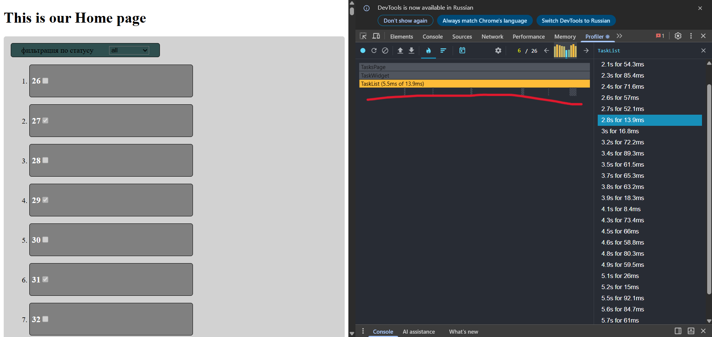

# LESSON-2 - react optimisation
ветка: lesson-2

## Запуск
npm run dev
npm run build & npm run preview

## Чеклист задач
1. Оптимизиовать TaskCard с помощью react.memo (3) ✅ - компонент обёрнут в React.memo
2. Мемоизация списка задач с useMemo (3) ✅ - хук переписан на вычисление значения во время рендера рендера, добавлена мемоизация значения через useMemo
3. Мемоизация фукций с usecallback (3) ✅ - добавлена мемоизация ссылки метода с useCallback
4. Аализ поизводительости чеез DevTools (3) ✅
  - мемоизация компонента карточки помогла избежать лишних рендеров при удалении элементов списка
  - если убрать useCallback, компоненты карточек начинают рендерится при каждой смене фильра/удалении т.к. ссылка на метод обновляется

## Не сделано \ вопросы
